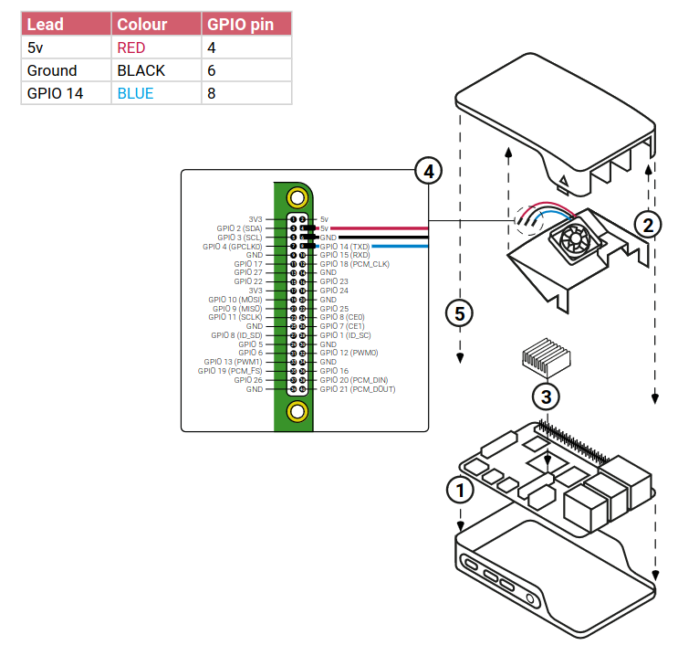

# Raspberry Pi 4B Fan Control

This project provides a PWM-based fan control solution for the Raspberry Pi 4B. It adjusts the fan speed based on the CPU temperature, ensuring efficient cooling while minimizing noise.

## Requirements

- Raspberry Pi 4B (I havn't tested with the other models)
- Docker installed on your Raspberry Pi
- Git installed on your Raspberry Pi
- PWM-compatible fan connected to GPIO 14 (or as specified in the configuration)



This diagram shows how to connect the PWM fan to your Raspberry Pi's GPIO pins (here GPIO 14).

## Installation Steps

1. **Clone the repository**:
```sh
git clone https://github.com/yourusername/raspberry-pi-fan-control.git
cd raspberry-pi-fan-control
```

2. [OPTIONAL] **Create the configuration file**:
```sh
sudo nano /etc/fan_control.conf
# Write the configuration options here
# Press Ctrl+X, then Y, then Enter to save and exit.
```
OR
```sh
sudo cp fan_control.conf /etc/fan_control.conf
# You can adjust the values as needed.
```

3. **Build the Docker image**:
```sh
docker build -t fan-control .
```

4. **Create the systemd service file**:
```sh
sudo cp raspberrypifan.service /etc/systemd/system/raspberrypifan.service
# You can adjust the parameters as needed.
```

5. **Reload the systemd daemon**:
```sh
sudo systemctl daemon-reload
```

6. **Enable the fan control service to start on boot**:
```sh
sudo systemctl enable raspberrypifan.service
```

7. **Start the fan control service**:
```sh
sudo systemctl start raspberrypifan.service
```

8. **Check the status of the service**:
```sh
sudo systemctl status raspberrypifan.service
```

## Usage

The fan control service will start automatically on boot. It will adjust the fan speed based on the CPU temperature according to the settings in the configuration file.

To view the logs:
```sh
sudo journalctl -u raspberrypifan.service -f
```

## Customization / Configuration Variables

The following variables can be configured in the `/etc/fan_control.conf` file:

- `pwm_gpio`: The GPIO pin number used for PWM fan control (default: 14)
- `wait_time`: Time in seconds between temperature checks (default: 10)
- `pwm_freq`: PWM frequency in Hz (default: 10000)
- `min_temp`: Minimum temperature in °C for fan activation (default: 55)
- `min_cool_temp`: Temperature in °C to deactivate the fan (default: 50)
- `max_temp`: Maximum temperature in °C for full fan speed (default: 75)
- `fan_low`: Minimum fan speed percentage (default: 50)
- `fan_high`: Maximum fan speed percentage (default: 100)

Additional constants in the code:

- `DEFAULT_CONFIG_FILE`: Path to the configuration file (default: "/etc/fan_control.conf")
- `DEFAULT_FAN_OFF`: Fan speed percentage when off (default: 0)
- `DEFAULT_FAN_MAX`: Maximum possible fan speed percentage (default: 100)


You can adjust the fan control parameters by editing the `/etc/fan_control.conf` file. After making changes, restart the service:
```sh
sudo nano /etc/fan_control.conf
# Make your changes, then save and exit (Ctrl+X, Y, Enter)
sudo systemctl restart raspberrypifan.service
```

## Troubleshooting

If you encounter any issues:

1. Check the logs:
```sh
sudo journalctl -u raspberrypifan.service -n 50
```

2. Ensure the fan is properly connected to the specified GPIO pin.

3. Verify that the Docker service is running:
```sh
sudo systemctl status docker
```

4. If you make changes to the Python script or Dockerfile, rebuild the Docker image and restart the service.

## Contributing

Contributions are welcome! Please feel free to submit a Pull Request.

## License

This project is licensed under the MIT License - see the LICENSE file for details.